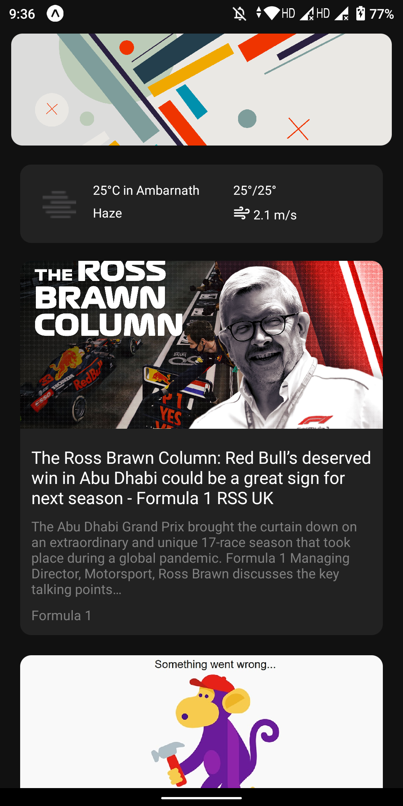
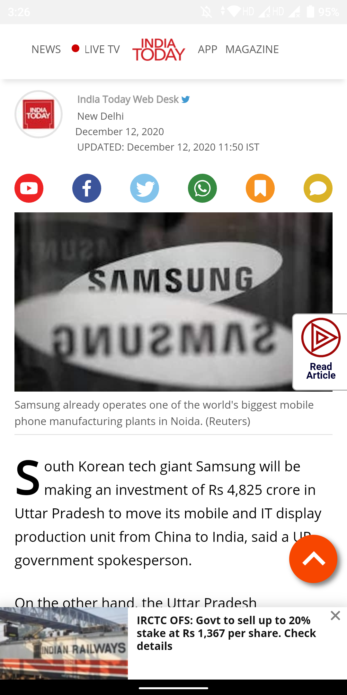

# Google News Feed Clone

## Table of Content
* [About](#about)
* [Installation](#install-locally)
* [ScreenShots](#screenshots)

## About
* This project was created for better understanding of APIs and React-native styling.
* The news feed uses http://newsapi.org for gathering news data.
* Created using Expo

## Install Locally
```
git clone https://github.com/hemantsirsat/Google-News-Feed-Clone.git
cd news
npm install
```
## ScreenShots
### Splash Screen
<br>
### Home Screen
<br>
### Details Screen
